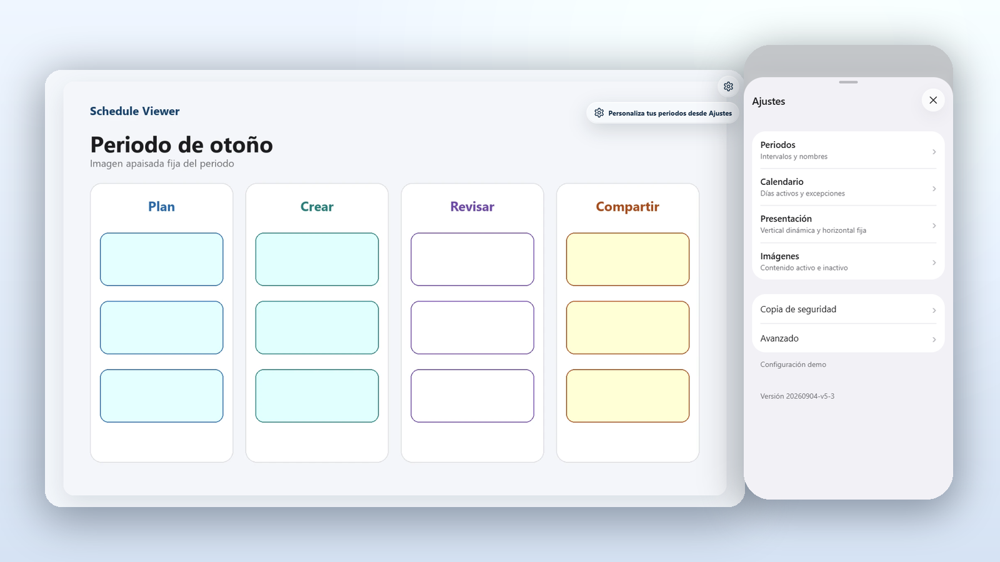
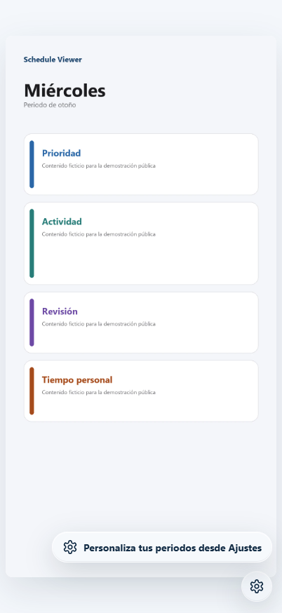
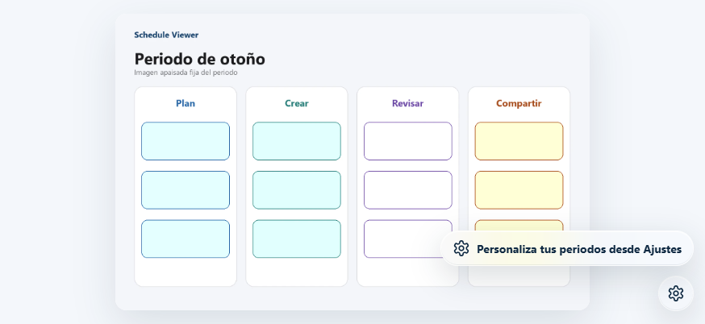
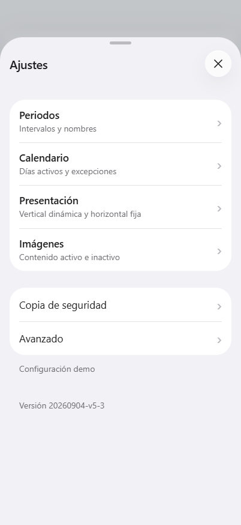
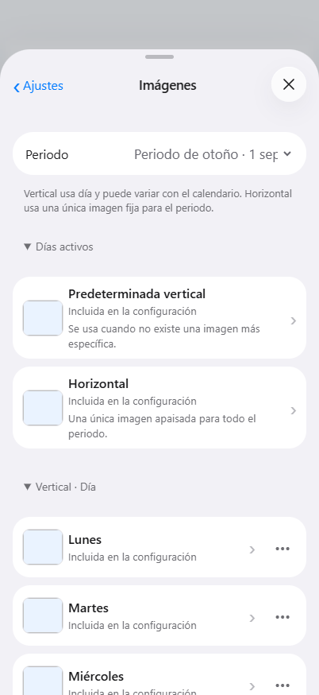
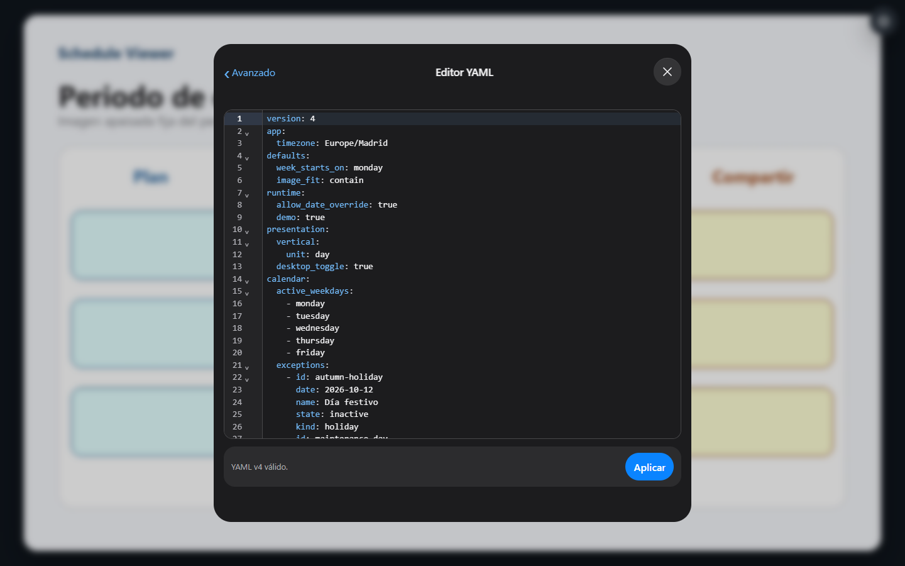

# Schedule Viewer

[](https://github.com/R3Neer/schedule-viewer/actions/workflows/pages.yml)
[](LICENSE)
[](docs/config-v4.md)

**A local-first, offline viewer that shows the right image for the current period, calendar state and screen orientation.**

<p align="center">
  <a href="https://r3neer.github.io/schedule-viewer/"><strong>Open the live app →</strong></a>
</p>



Schedule Viewer turns your own images into a date-aware display. Define named periods, active days, exceptions and inactive intervals; the app then selects the appropriate portrait or landscape image. It works as a static PWA, needs no account and sends no personal configuration to a server.

## Why Schedule Viewer

- **Calendar-aware, not timetable-specific.** Use it for rotating displays, household plans, events, study periods, seasonal information or any other image-based schedule.
- **Predictable presentation.** Portrait can vary by weekday, real week or calendar month. Landscape uses one stable image for each period.
- **Useful exceptions.** A weekly active pattern combines with exact active/inactive dates and named inactive intervals such as holidays, closures or breaks.
- **Private by design.** Configuration and original image bytes stay in IndexedDB on the device. There is no account, backend, telemetry or analytics.
- **Offline and installable.** The app shell and saved content work offline and can be added to an iPhone or iPad Home Screen.
- **Portable.** A `.schedule` backup moves the configuration and its images together; YAML import/export handles the configuration alone.
- **Lossless image storage.** PNG, JPEG, WebP, AVIF and animated GIF retain their original bytes. User-provided SVG is deliberately rejected.
- **Accessible controls.** Keyboard navigation, visible focus, safe touch gestures, high-contrast YAML editing and interruptible motion support Reduce Motion.

## See it in action

<table>
  <tr>
    <td align="center"><strong>Portrait: calendar-specific image</strong></td>
    <td align="center"><strong>Landscape: fixed period image</strong></td>
  </tr>
  <tr>
    <td></td>
    <td></td>
  </tr>
</table>

<table>
  <tr>
    <td align="center"><strong>Grouped settings</strong></td>
    <td align="center"><strong>Image assignments with previews</strong></td>
  </tr>
  <tr>
    <td></td>
    <td></td>
  </tr>
</table>



Every screenshot uses deterministic artwork generated inside this repository. It contains no personal timetable, institution-specific data, AI-generated imagery or third-party artwork.

## Get started

1. Open the [live app](https://r3neer.github.io/schedule-viewer/).
2. Open the floating settings control.
3. Add or edit **Periodos** and define the active pattern and exceptions under **Calendario**.
4. Choose the portrait unit under **Presentación**, then assign images under **Imágenes**.
5. Select **Guardar cambios** and export a `.schedule` backup before clearing browser data or moving devices.

The interface is currently in Spanish. On touch devices, portrait selects the Vertical presentation and landscape selects Horizontal automatically. On desktop, Horizontal is the default and Space can alternate presentations when enabled.

## How selection works

```text
current date
    ↓
matching named period
    ↓
exact exception → inactive interval → weekly pattern → outside-period state
    ↓
portrait unit image or fixed landscape image
```

Within the selected period, an exact active exception has highest priority, followed by an exact inactive exception, an inactive interval and the weekly pattern. Missing specific portrait images fall back to that period's default portrait image.

## Data, backups and compatibility

The public demo starts from [`config/schedule.yaml`](config/schedule.yaml). The browser stores edited configuration and image bytes locally in IndexedDB.

- **Export YAML** writes configuration v4 without local image bytes.
- **Export backup** writes a `.schedule` package containing configuration, filenames, MIME types and exact image bytes.
- Imports are validated before replacing current data and identify the failing schema path.
- Compatible image-backed v3 configurations migrate automatically.
- Legacy configurations that depend on generated timetable structures or SVG remain isolated and recoverable instead of being overwritten.

Read the complete [configuration v4 contract](docs/config-v4.md) and [local storage and backup model](docs/local-config.md).

## Browser support

The release barrier exercises current Chromium and WebKit. The PWA is designed for modern Safari/iOS and Chromium-based desktop browsers. WebKit automation is a technical approximation; behavior on a physical iPhone is validated separately after deployment.

## Development

Requirements: Python 3.11+, Node.js 22+ and Playwright browser dependencies.

```bash
python -m pip install -r requirements.txt
npm ci --no-audit --no-fund
npx playwright install chromium webkit

python tools/audit_public_tree.py
python tools/validate_config.py
python tests/config-v4.test.py
npm test
python tools/build.py --out dist
npm run test:e2e
npx playwright test --config=playwright.apple.config.mjs
```

Serve `dist/` through HTTP. Opening `index.html` directly cannot provide the Service Worker environment.

To regenerate the committed screenshots and visual-review matrix after a UI change:

```bash
npm run capture:readme
python tools/compose_readme_media.py
python tools/validate_showcase.py
```

The complete device and visual barrier is documented in [Quality assurance](docs/qa.md). See [Contributing](CONTRIBUTING.md), [Security](SECURITY.md) and the [v1.0.0 release checklist](docs/release-v1.0.0.md) before publishing changes.

## Architecture and deployment

Schedule Viewer is framework-free application code around small calendar, view, persistence and configuration modules. Heavy YAML/editor, backup and optical-glass code is loaded only when needed. GitHub Actions builds the exact static artifact, verifies its offline/update boundaries and deploys that artifact to Pages after every successful push to `main`.

Release-isolated module paths prevent an older installed Service Worker from mixing stale JavaScript with a new deployment. App updates preserve IndexedDB configuration and image bytes.

## License

Schedule Viewer is available under the [MIT License](LICENSE). Runtime dependency notices are in [Third-party notices](THIRD_PARTY_NOTICES.md).
