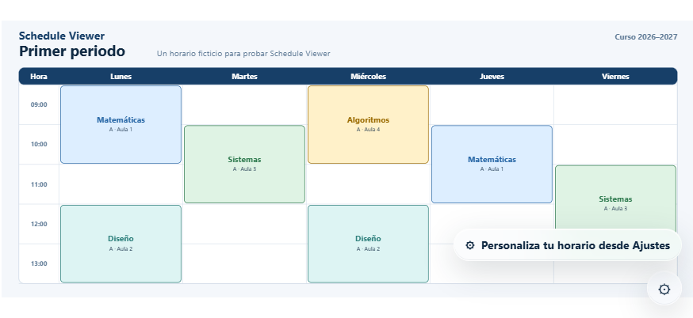

# Schedule Viewer

[](https://github.com/R3Neer/schedule-viewer/actions/workflows/pages.yml)
[](LICENSE)

A local-first, offline timetable viewer that adapts to your screen and stays entirely on your device.

<p align="center">
  <a href="https://r3neer.github.io/schedule-viewer/"><strong>Open the live demo →</strong></a>
</p>


Schedule Viewer ships with a neutral fictional timetable. Open **Ajustes** to turn it into your own: choose the visible range, inactive days and artwork for each day or period. There is no account, server or analytics layer.

## Highlights

- **Local by design.** Configuration and imported images live in IndexedDB in your browser.
- **Works offline.** The application shell and generated demo are cached by a Service Worker.
- **Responsive views.** Day, week, month, year, rolling and fixed intervals can be assigned independently to touch orientations and desktop modes.
- **Flexible calendars.** Recurring inactive weekdays, explicit active/inactive dates, holidays, vacations and future academic periods are supported.
- **Per-day artwork.** Use different images for active weekdays, weekly views and inactive calendar states.
- **Portable backups.** A `.schedule` file contains configuration and local images; YAML import/export is also available for advanced editing.
- **Accessible motion.** Apple-style settings transitions remain interruptible and honor Reduce Motion.

## A closer look

<table>
  <tr>
    <td align="center"><strong>Per-day artwork</strong></td>
    <td align="center"><strong>Responsive weekly view</strong></td>
  </tr>
  <tr>
    <td></td>
    <td></td>
  </tr>
</table>


The public-domain, non-AI source images used for these screenshots and their exact provenance are documented in [`showcase/README.md`](showcase/README.md). They are capture fixtures only and are not shipped in the live demo or offline cache.

## Use it

1. Open the [live app](https://r3neer.github.io/schedule-viewer/).
2. Select the floating settings button.
3. Configure **Horario**, **Imágenes** and, if needed, **Avanzado**.
4. Save a `.schedule` backup before moving to another browser or clearing site data.

On iPhone or iPad, use Safari's **Add to Home Screen** action for a standalone, full-screen experience. The app checks for new published releases and reloads only when no settings operation can lose work.

## Local data and backups

```text
neutral static demo
        ↓
   settings UI
        ↓
IndexedDB configuration + image Blobs
        ↓
   responsive renderer
```

The application never silently uploads your timetable or images. A YAML export contains configuration only; use **Copia de seguridad** to include local images in a `.schedule` package.

Resetting the demo removes the local customization for this app. Browser storage controls can do the same, so keep a backup of anything important.

## Configuration model

The repository keeps its public demo in [`config/schedule.yaml`](config/schedule.yaml). The build validates and compiles it to JSON; the runtime does not load a YAML parser until the advanced editor is opened.

```text
config/schedule.yaml → validated v3 model → dist/config/schedule.json
```

See [`docs/config-v3.md`](docs/config-v3.md) for the schema, ranges, calendar rules and content precedence. Future years and periods can be added through the YAML editor without changing application code.

## Development

Requirements: Python 3.11+, Node.js 22+ and the Playwright browser dependencies.

```bash
python -m pip install -r requirements.txt
npm ci --no-audit --no-fund
npx playwright install chromium webkit

python tools/validate_config.py
python tests/config-v3.test.py
npm test
python tools/build.py --out dist
npm run test:e2e
```

Serve `dist/` from a local HTTP server; opening the HTML directly does not provide the Service Worker environment.

To regenerate the committed showcase after a UI change:

```bash
npm run capture:readme
python tools/compose_readme_media.py
```

The capture uses fresh browser profiles, imports the documented fixture images into IndexedDB and never modifies the public YAML demo. More detail is available in [`docs/qa.md`](docs/qa.md) and [`CONTRIBUTING.md`](CONTRIBUTING.md).

## Deployment

Every push and pull request runs schema validation, unit contracts, an exact production build, Chromium E2E, offline/update coverage and the real Liquid Glass renderer under WebKit. Only a successful push to `main` is uploaded to GitHub Pages.

Release-specific module paths prevent an older installed Service Worker from substituting stale JavaScript after an update. Local configuration and image Blobs remain in IndexedDB across releases.

## License and credits

Schedule Viewer is released under the [MIT License](LICENSE). Third-party software and showcase artwork are listed in [`THIRD_PARTY_NOTICES.md`](THIRD_PARTY_NOTICES.md).
