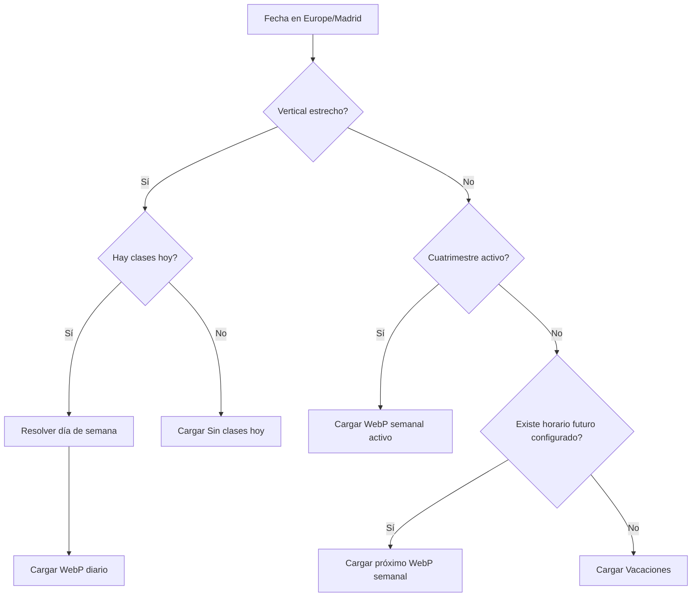

# Especificación — UCM Scheduler

## 1. Objetivo

Aplicación web estática para mostrar automáticamente el horario personal del curso según:

- fecha actual en `Europe/Madrid`;
- calendario lectivo;
- festivos y días no lectivos;
- tamaño y orientación de pantalla.

El navegador debe cargar **una única imagen de horario** en cada estado.

## 2. Modos de visualización

### Móvil estrecho en vertical

Muestra la vista del **día actual**.

- Día lectivo: horario diario correspondiente.
- Sábado o domingo: `Sin clases hoy`.
- Festivo: `Sin clases hoy`.
- Día no lectivo: `Sin clases hoy`.
- Vacaciones o fecha fuera de un cuatrimestre: `Sin clases hoy`.

La regla responsive inicial es:

- ancho `< 760 px`;
- orientación vertical.

### Horizontal o pantalla ancha

Muestra una **vista semanal**.

- Dentro de un cuatrimestre: horario semanal del cuatrimestre activo.
- Fuera de un cuatrimestre: si existe en configuración un cuatrimestre posterior con horario semanal, se muestra ese próximo horario.
- Si no existe ningún horario futuro configurado: `Vacaciones`.

Por tanto, durante unas vacaciones el horario siguiente aparece automáticamente en cuanto ese siguiente cuatrimestre o curso se incorpora al fichero de configuración. No existe una fecha de promoción hardcodeada.

### Móvil en horizontal

Se muestra la semana completa. Para conservar legibilidad, la imagen usa todo el ancho y puede requerir un pequeño scroll vertical.

## 3. Patrón visual diario

Todas las imágenes diarias de un mismo cuatrimestre deben tener:

- exactamente el mismo tamaño de lienzo;
- exactamente la misma cabecera;
- exactamente la misma escala temporal;
- las mismas posiciones para cada hora;
- la misma tipografía, colores, márgenes y estructura.

Los huecos entre clases permanecen visibles. La composición **no se recoloca** para compactar días con pocas asignaturas.

Esto hace que el ojo aprenda una geometría estable.

### Tamaño implementado

- Diario vertical: `1080 × 2160 px`.
- Semanal horizontal: `1600 × 1000 px`.

## 4. Lenguaje visual

- fondo blanco / gris azulado muy claro;
- azul oscuro institucional como color estructural;
- colores pastel estables por asignatura;
- bordes finos y redondeados;
- tipografía sans serif de alta legibilidad;
- cada asignatura conserva su color entre vista diaria y semanal;
- grupo y aula aparecen dentro del bloque o en la clave inferior.

## 5. Assets

Por cuatrimestre:

- 1 WebP semanal horizontal;
- 5 WebP diarios verticales.

Estados globales:

- `no-class-today-vertical.webp`;
- `vacations-horizontal.webp`.

Los assets no se diseñan a mano uno a uno. Se generan de forma reproducible desde `config/schedules.json` mediante `tools/render_assets.py`.

## 6. Configuración

La fuente de verdad es:

`config/schedules.json`

Debe admitir:

- cursos académicos;
- cuatrimestres;
- fecha inicial y final;
- asignaturas;
- nombre corto y completo;
- grupo;
- aula;
- color;
- sesiones semanales;
- festivos;
- festividades académicas;
- periodos no lectivos;
- rutas de assets;
- fuentes oficiales de cada horario.

## 7. Festivos y días no lectivos

Una fecha puede quedar sin clases por:

1. fin de semana;
2. excepción individual en `exceptions`;
3. pertenencia a un `nonTeachingPeriod`;
4. no existir cuatrimestre lectivo activo.

En vista diaria todos estos casos resuelven a `Sin clases hoy`.

En vista semanal un festivo puntual no elimina la semana: se sigue mostrando el horario semanal, porque la vista semanal representa la estructura del cuatrimestre y no únicamente el día actual.

## 8. Próximo horario durante vacaciones

Cuando no existe un cuatrimestre activo, la lógica busca el primer cuatrimestre posterior cuya vista semanal esté configurada.

- Si existe: lo muestra.
- Si no existe: muestra `Vacaciones`.

Esta búsqueda funciona también entre cursos académicos, por lo que añadir el curso siguiente permite que el verano empiece a previsualizar automáticamente ese nuevo horario.

## 9. Arquitectura

```text
/
├── index.html
├── styles.css
├── package.json
├── requirements.txt
├── config/
│   └── schedules.json
├── src/
│   ├── app.js
│   └── schedule-core.js
├── tools/
│   ├── build.py
│   ├── render_assets.py
│   └── validate_config.py
├── tests/
│   └── schedule-core.test.mjs
├── docs/
│   └── especificacion.md
└── .github/
    └── workflows/
        └── pages.yml
```

`dist/` se genera durante el build y no se versiona.

## 10. Flujo de ejecución en navegador



En el DOM existe un único elemento ``. Al cambiar de orientación se actualiza su `src`.

## 11. Build

`tools/build.py`:

1. crea `dist/`;
2. copia HTML, CSS, JS y configuración;
3. genera todos los WebP desde los datos estructurados;
4. añade `.nojekyll`.

## 12. Pruebas

### Validación estructural

`tools/validate_config.py` comprueba, entre otras cosas:

- fechas y horas válidas;
- referencias de asignaturas;
- presencia de los cinco assets diarios;
- ausencia de solapamientos de sesiones dentro de un mismo día.

### Pruebas de selección

`tests/schedule-core.test.mjs` cubre:

- antes del comienzo de curso;
- día lectivo;
- fin de semana;
- festivo;
- periodo entre cuatrimestres;
- segundo cuatrimestre;
- Semana Santa;
- vacaciones de verano.

### Pruebas visuales

Se comprueban mediante navegador headless distintos viewports de escritorio, móvil vertical y móvil horizontal, verificando escalado y legibilidad de las imágenes generadas.

## 13. Despliegue

GitHub Actions ejecuta:

1. validación;
2. tests JS;
3. generación de assets;
4. build de `dist/`;
5. subida del artefacto Pages;
6. despliegue en GitHub Pages.

El repositorio no necesita backend, base de datos ni servidor de aplicación.

## 14. Extensión a futuros años

Para un nuevo curso:

1. añadir el nuevo año a `config/schedules.json`;
2. añadir cuatrimestres, asignaturas y sesiones;
3. añadir excepciones y periodos no lectivos;
4. definir las rutas de assets;
5. hacer push.

El workflow regenera imágenes y despliega sin modificar la lógica principal.
